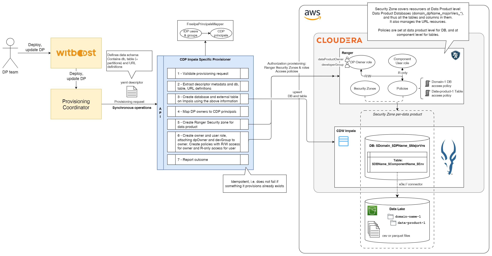
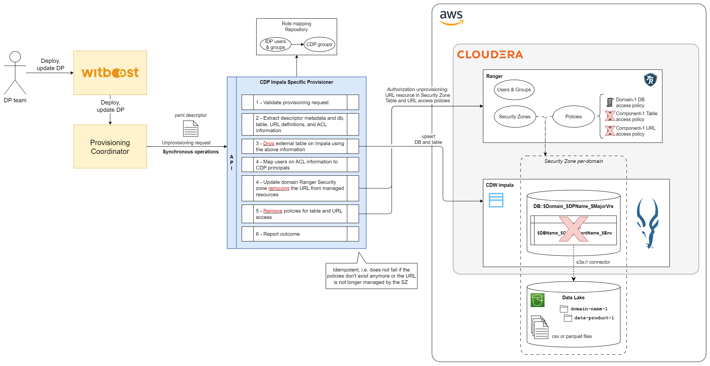
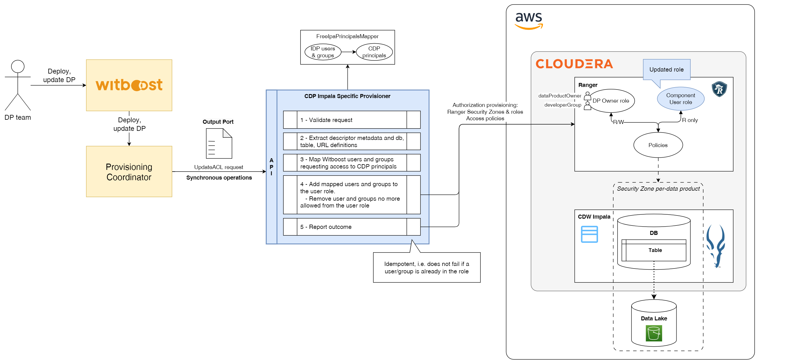
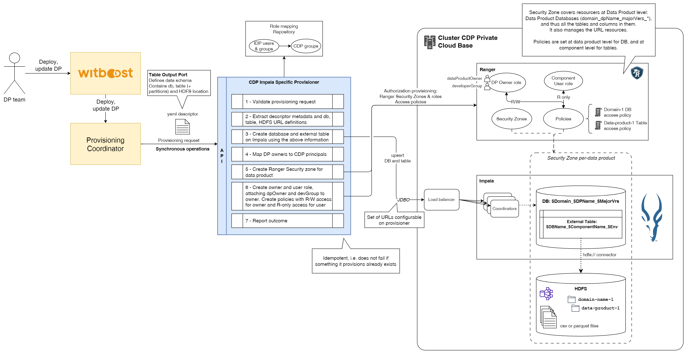
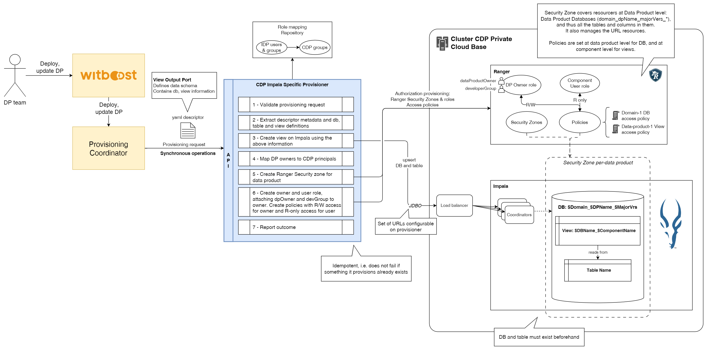
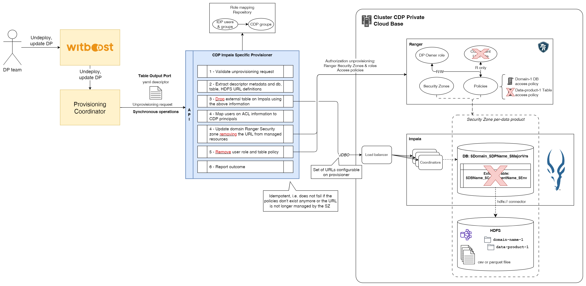
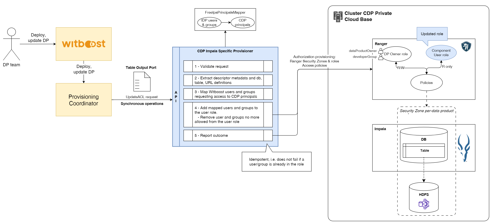
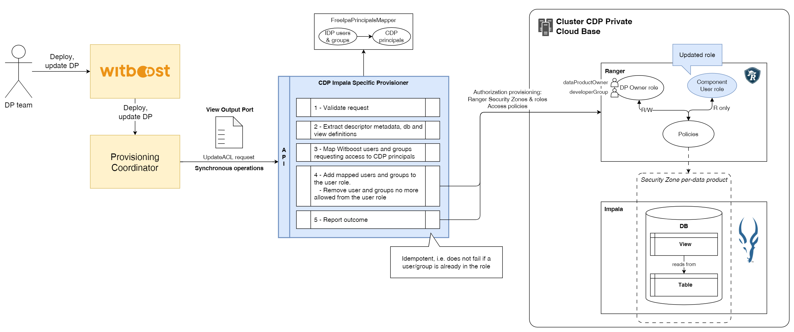
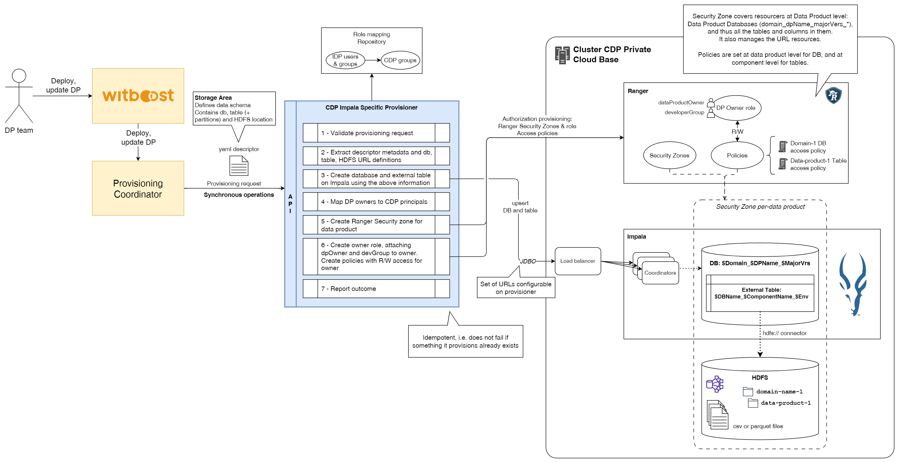
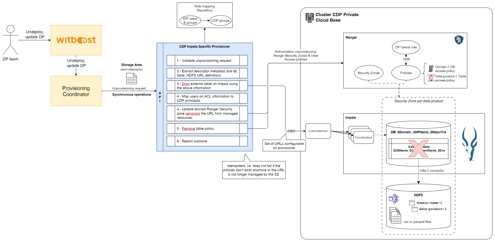

# High Level Design

This document describes the High Level Design of the CDP Impala Specific Provisioner.
The source diagrams can be found and edited in the [accompanying draw.io file](hld.drawio).

- [Overview](#overview)
- [CDP Public](#cdp-public-cloud-impala-specific-provisioner)
  - [Provisioning](#provisioning)
  - [Unprovisioning](#unprovisioning)
  - [Update ACL](#update-acl)
- [CDP Private](#cdp-private-cloud-base-impala-specific-provisioner)
  - [Output Port](#output-port)
    - [Provisioning](#provisioning-1)
    - [Unprovisioning](#unprovisioning-1)
    - [Update ACL](#update-acl-1)
  - [Storage Area](#storage-area)
    - [Provisioning](#provisioning-2)
    - [Unprovisioning](#unprovisioning-2)
## Overview

### Specific Provisioner

A Specific Provisioner (SP) is a service in charge of performing a resource allocation task, usually through a Cloud Provider. The resources to allocate are typically referred to as the _Component_, the details of which are described in a YAML file, known as _Component Descriptor_.

The SP is invoked by an upstream service of the Witboost platform, namely the Coordinator, which is in charge of orchestrating the creation of a complex infrastructure by coordinating several SPs in a single workflow. The SP receives the _Data Product Descriptor_ as input with all the components (because it might need more context) plus the id of the component to provision, named  componentIdToProvision_

To enable the above orchestration a SP exposes an API made up of five main operations:
- validate: checks if the provided component descriptor is valid and reports any errors
- provision: allocates resources based on the previously validated descriptor; clients either receive an immediate response (synchronous) or a token to monitor the provisioning process (asynchronous)
- status: for asynchronous provisioning, provides the current status of a provisioning request using the provided token
- unprovision: destroys the resources previously allocated.
- updateacl: grants access to a specific component/resource to a list of users/groups

## CDP Public Cloud Impala Specific Provisioner

This Specific Provisioner interacts with a CDP Environment and provisions an Output Port based on an Impala external table created on a Cloudera Data Warehouse (CDW) Impala Virtual Warehouse. This table exposes data contained in a S3 bucket.

The database name should be created using the domain name, data product name, and major version of the data product. The table instead should include these values plus the component name and environment it belongs to. Its schema and partitioning should be defined by the user using the appropriate descriptor fields.

Resource names:
- **Database**: `$Domain_$DPName_$MajorVersion`
- **Table**: `$DBName_$ComponentName_$Environment`

Furthermore, this provisioner also needs to interact with the Apache Ranger instance of the CDP environment in order to create the necessary security zones at domain level to handle the resources, as well as the necessary access policies to allow owners to manage these resources (read-write), and users to consume the data (read-only).

Access policy names:
- **Database policy**: `$DBName_access_policy`
- **Table access policy**: `$DBName_$TableName_access_policy`

These access policies are granted to single users and groups using roles as intermediaries. Read-write access is granted to the owner role, which will include the data product owner user and the development group, while read-only access is granted to the user role, this last one used only for Output Ports, where the allowed users and groups (through the updateacl operation) will be assigned.

Role names:
- **Owner role**: `$Domain_$DPName_$MajorVersion_owner`
- **User role**: `$Domain_$DPName_$MajorVersion_$ComponentName_read`

The provisioner will be designed as a microservice implementing v1 endpoints of version 2.2.0 of interface-specification, thus it should handle all requests synchronously.

The creation and management of the S3 bucket, as well as the data contained in it, is out of the scope of the provisioner, as it only creates the external table based on it. For this reason, the deploy user configured for the microservice should have the permissions to access the S3 bucket.

### Provisioning

The provisioning task creates (if not existent) the database and tables on the Impala VW based on the received parameters, it then creates the security zone, roles and policies in order to manage the access control of these resources.

The Security Zone is created at data product version level. Read/Write policies for owners and Read-only policies for users are handled using a pair of roles. An owner role at data product level for read-write access to the component, and a user role at component level for read-only access. Mapping between principals in the incoming descriptor and the CDP groups is done using a PrincipalsMapper interface which checks the existence of said principals on CDP.

### Unprovisioning

Unprovisioning consists of removing the existing (if any) created tables on Impala, deleting the Ranger access policies for the provisioned table, the user role, and removing the s3 URL connector from the Security Zone managed resources. For concurrency safety, the provisioner never drops databases or schemas, this should be done manually. For the same reason, it doesn't remove the database access policy.

### Update Acl

The Update Acl operation consists of updating the assignments to the user role, adding the received principals to the user, while removing the ones already present in the role but not received anymore on the request.

## CDP Private Cloud Base Impala Specific Provisioner

This Specific Provisioner is configured to also work with a CDP Private environment, although with different limitations. It provides functionality to provision Output Ports based on either Impala external table or Views, both created on an Impala instance on the Private Cloud cluster. In CDP Private, this table exposes data stored in the HDFS cluster.

Furthermore, it allows to provision Storage Areas as External Tables, its main difference from Output Ports being that Storage Areas are internal to the logic of the Data Product and thus don't expose information, this is translated into the creation of only an Owner role, not a user role.

The provisioner is designed to work with CDP Private v7.1.7 which includes Apache Impala 3.4.0 and Apache Ranger 2.1.0.

The same considerations as the CDP Public for database and table management follow, including the access management through Ranger policies. The creation and management of HDFS, as well as the data contained in it, is out of the scope of the provisioner, as it only creates the external table based on it.

### Output Port

The provisioner provides the functionality to deploy Output Ports either by creating an External Table or a View. The following section will explain the provisioning, unprovisioning and update ACL processes for both types. Where not specified, the process is the same for both types of Output Port.  

#### Provisioning

The provisioning task creates (if not existent) the table or view on the Impala environment based on the received parameters, creating also the database (if not existent) for External Table Output Ports; while for Views a database and a table to read from must exist beforehand. The provisioner then creates the security zone, roles and policies in order to manage the access control of these resources.

Differently from the CDW experience, when the Specific Provisioner is configured to work with CDP Private, it should define a configurable list of JDBC URLs in order to communicate with the set of Impala coordinators. If the deployed infrastructure includes a load balancer for Impala, the list may contain just one entry corresponding to the load balancer URL. Because of this, the descriptor only needs to include the HDFS location of the files. 

Ranger roles and policy management acts the same as the CDP Public provisioning explained above. 

**Provisioning External Table Output Ports**

**Provisioning View Output Ports**

#### Unprovisioning

Unprovisioning works the same as the CDP Public version, dropping the external table or view, and removing the appropriate user policies and roles.

**Unprovisioning External Table Output Ports**

**Unprovisioning View Output Ports**

#### Update ACL

The Update ACL operation works the same as the CDP Public version, updating the user role with the received refs.

**Update ACL External Table Output Ports**

**Update ACL View Output Ports**

### Storage Area

The management of Storage Areas behaves equally to the Output Ports based on Storage Areas, with the exclusion of the creation of the User role.

#### Provisioning

#### Unprovisioning

