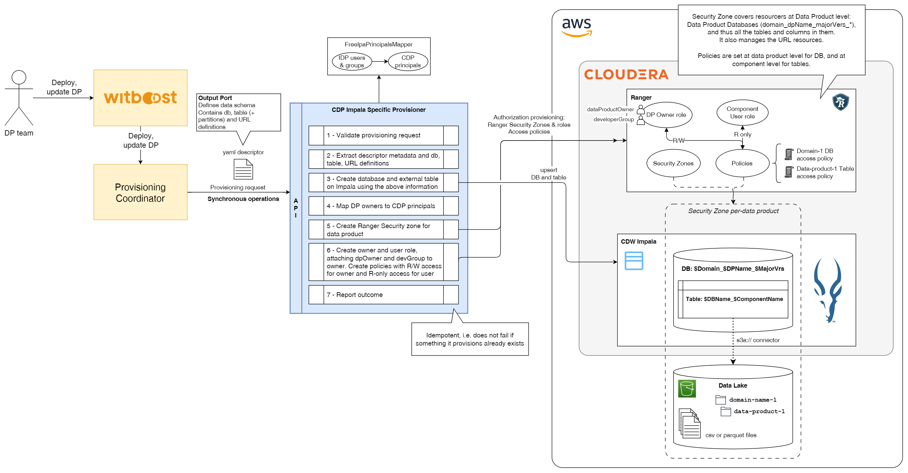
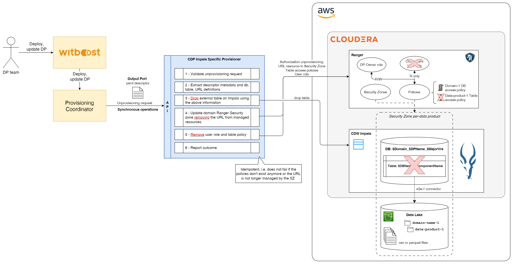

# High Level Design

This document describes the High Level Design of the CDP Impala Specific Provisioner.
The source diagrams can be found and edited in the [accompanying draw.io file](hld.drawio).

## Overview

### Specific Provisioner

A Specific Provisioner (SP) is a service in charge of performing a resource allocation task, usually
through a Cloud Provider. The resources to allocate are typically referred to as the _Component_, the
details of which are described in a YAML file, known as _Component Descriptor_.

The SP is invoked by an upstream service of the Witboost platform, namely the Coordinator, which is in charge of orchestrating the creation
of a complex infrastructure by coordinating several SPs in a single workflow. The SP receives
the _Data Product Descriptor_ as input with all the components (because it might need more context) plus the id of the component to provision, named _componentIdToProvision_

To enable the above orchestration a SP exposes an API made up of five main operations:
- validate: checks if the provided component descriptor is valid and reports any errors
- provision: allocates resources based on the previously validated descriptor; clients either receive an immediate response (synchronous) or a token to monitor the provisioning process (asynchronous)
- status: for asynchronous provisioning, provides the current status of a provisioning request using the provided token
- unprovision: destroys the resources previously allocated.
- updateacl: grants access to a specific component/resource to a list of users/groups

### CDP Impala Specific Provisioner

This Specific Provisioner interacts with a CDP Environment and provisions an Output Port based on an Impala external table created on a Cloudera Data Warehouse (CDW) Impala Virtual Warehouse. This table exposes data contained in a S3 bucket.

The database name should be created using the domain name, data product name, and major version of the data product. The table instead should include these values plus the component name and environment it belongs to. Its schema and partitioning should be defined by the user using the appropriate descriptor fields.

Resource names:
- **Database**: `$Domain_$DPName_$MajorVersion`
- **Table**: `$DBName_$ComponentName_$Environment`

Furthermore, this provisioner also needs to interact with the Apache Ranger instance of the CDP environment in order to create the necessary security zones at domain level to handle the resources, as well as the necessary access policies to allow owners to manage these resources (read-write), and users to consume the data (read-only).

Access policy names:
- **Database policy**: `$DBName_access_policy`
- **Table access policy**: `$DBName_$TableName_access_policy`
- **URL access policy**: `$DBName_$TableName_url_access_policy`

Mapping between the IDP principals of witboost and the CDP principals should be performed using a configurable repository.

The provisioner will be designed as a microservice implementing v1 endpoints of version 2.2.0 of interface-specification, thus it should handle all requests synchronously.

The creation and management of the S3 bucket, as well as the data contained in it, is out of the scope of the provisioner, as it only creates the external table based on it. For this reason, the deploy user configured for the microservice should have the permissions to access the S3 bucket.

## Provisioning

The provisioning task creates (if not existent) the database and tables on the Impala VW based on the received parameters, it then creates the security zone, roles and policies in order to manage the access control of these resources.

The Security Zone is created at domain level to manage all data products. Read/Write policies for owners and Read-only policies for users are handled using a set of groups, and mapping between users in the incoming descriptor and the CDP groups is done using a configurable Repository.

Owners and users are defined based on the received descriptor fields

## Unprovisioning

Unprovisioning consists of removing the existing (if any) created tables on Impala, deleting the Ranger access policies for the provisioned table and URL resources, and removing from the Security Zone managed resources the URL. For concurrency safety, the provisioner never drops databases or schemas, this should be done manually. For the same reason, it doesn't remove the database access policy.

